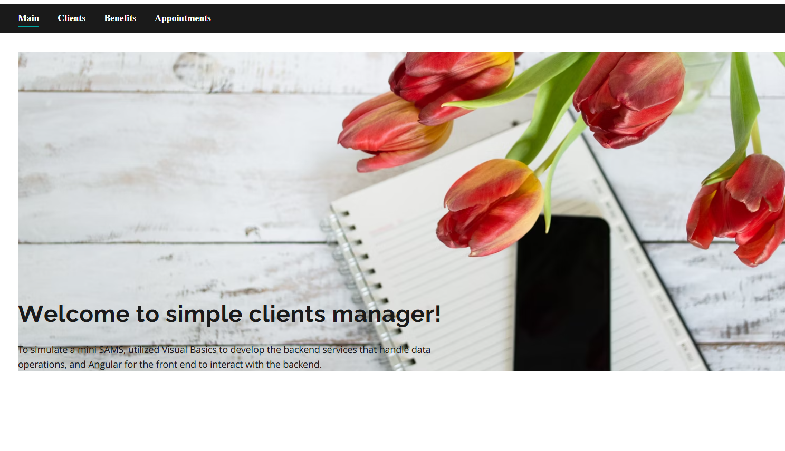
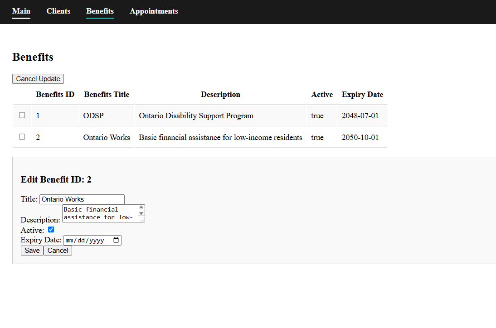
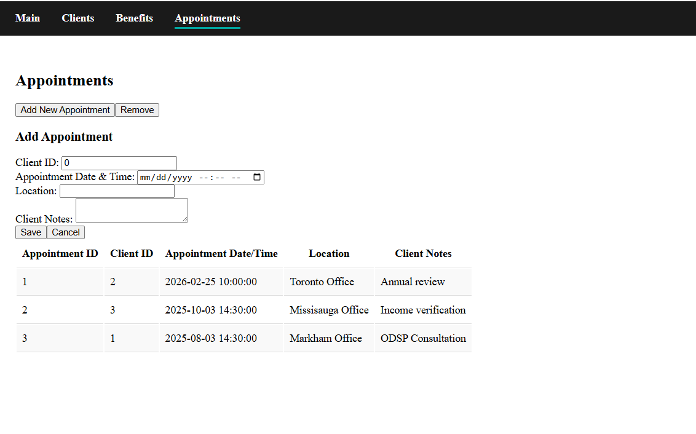
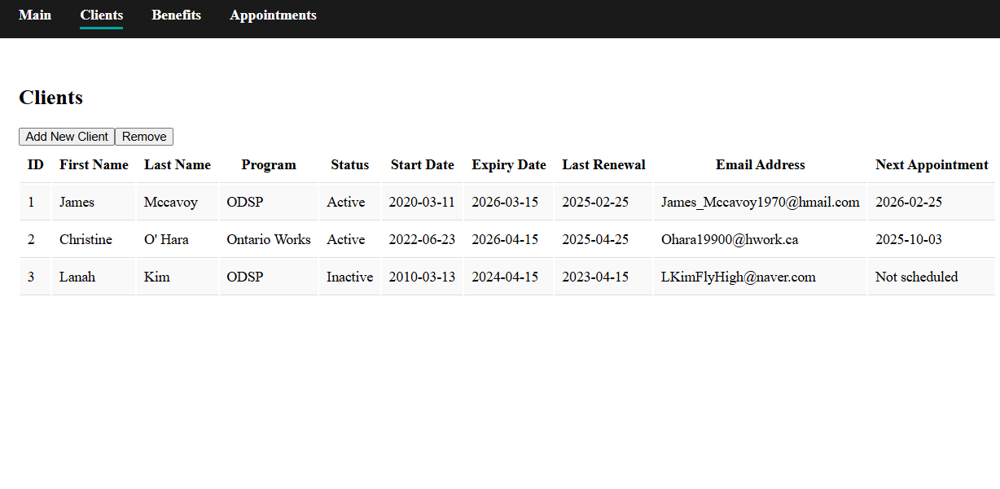

# simpleBenefitsTracker

Downgraded to Angular v.16 for compatibility with the Ontario Design System.

Used Visual Basics as a backend as a mini SAMS with an Angular front end.

Able to add and remove clients, update benefits, and add and remove appointments. The backend is able to accommodate getting, adding, removing and updating for all three categories.

Used Visual Studio Code to run the Angular front end and Visual Studio IDE for the Visual Basics backend.

If your local backend runs on a different port from https://localhost:44333/, please update src/environments/environment.ts with your local URL.

